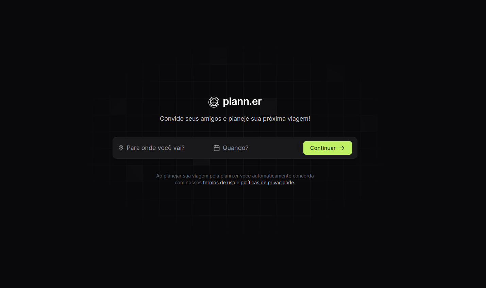
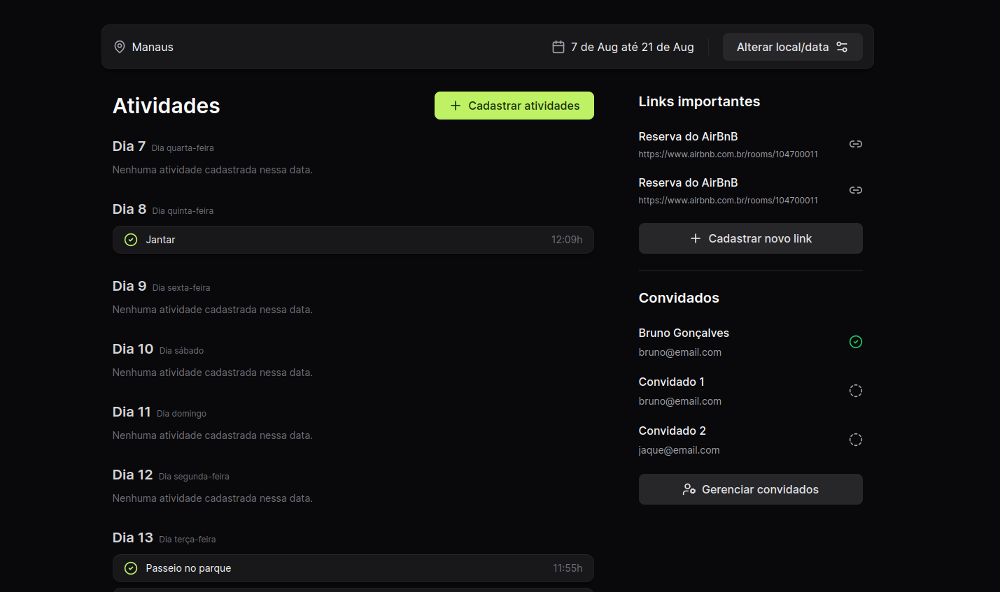

<!--- # "Can be a image or a gift from the project pages" -->
# NLW Journey

 Plann.er é um aplicativo web de planejamento de viagens desenvolvido para ajudar os usuários a organizar suas viagens com eficiência. Ele permite que os usuários salvem datas de viagens, compartilhem o acesso com familiares e amigos e criem cronogramas detalhados de atividades.

 ## Layout do App

 
 

## Tech Stack

<!--- # "Verify icons availability here https://github.com/tandpfun/skill-icons" -->

## Used libraries
- Axios
- Date-fns
- Lucide-react
- Tailwind-variants
- React-day-picker

## Getting Started Frontend

1. **Clonar Repo frontend**: `https://github.com/brunogoncalvesferreira/nlw-journey-frontend`
2. **Install Dependencies**: `npm install`
3. **Start frontend**: `npm run dev`

## Getting Started Backend

1. **Clonar Repo backend**: `https://github.com/brunogoncalvesferreira/backend.git`
2. **Install Dependencies**: `npm install`
3. **Create .env**: `.env`
4. **Start backend**: `npm run dev`

## License

This software is available under the following licenses:

- [MIT](https://rem.mit-license.org)